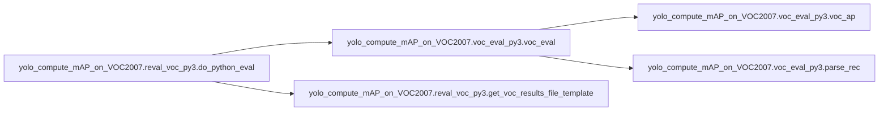

# Yolo Compute Map On Voc2007 Reval Voc Py3

[_Documentation generated by Documatic_](https://www.documatic.com)

<!---Documatic-section-Codebase Structure-start--->
## Codebase Structure

<!---Documatic-block-system_architecture-start--->

<!---Documatic-block-system_architecture-end--->

# #
<!---Documatic-section-Codebase Structure-end--->

<!---Documatic-section-yolo_compute_mAP_on_VOC2007.reval_voc_py3.parse_args-start--->
## yolo_compute_mAP_on_VOC2007.reval_voc_py3.parse_args

<!---Documatic-section-parse_args-start--->
<!---Documatic-block-yolo_compute_mAP_on_VOC2007.reval_voc_py3.parse_args-start--->
<details>
	<summary><code>yolo_compute_mAP_on_VOC2007.reval_voc_py3.parse_args</code> code snippet</summary>

```python
def parse_args():
    parser = argparse.ArgumentParser(description='Re-evaluate results')
    parser.add_argument('output_dir', nargs=1, help='results directory', type=str)
    parser.add_argument('--voc_dir', dest='voc_dir', default='/home/pascal/person_data2/VOCdevkit', type=str)
    parser.add_argument('--year', dest='year', default='2007', type=str)
    parser.add_argument('--image_set', dest='image_set', default='test', type=str)
    parser.add_argument('--classes', dest='class_file', default='data/voc.names', type=str)
    if len(sys.argv) == 1:
        parser.print_help()
        sys.exit(1)
    args = parser.parse_args()
    return args
```
</details>
<!---Documatic-block-yolo_compute_mAP_on_VOC2007.reval_voc_py3.parse_args-end--->
<!---Documatic-section-parse_args-end--->

# #
<!---Documatic-section-yolo_compute_mAP_on_VOC2007.reval_voc_py3.parse_args-end--->

<!---Documatic-section-yolo_compute_mAP_on_VOC2007.reval_voc_py3.get_voc_results_file_template-start--->
## yolo_compute_mAP_on_VOC2007.reval_voc_py3.get_voc_results_file_template

<!---Documatic-section-get_voc_results_file_template-start--->
<!---Documatic-block-yolo_compute_mAP_on_VOC2007.reval_voc_py3.get_voc_results_file_template-start--->
<details>
	<summary><code>yolo_compute_mAP_on_VOC2007.reval_voc_py3.get_voc_results_file_template</code> code snippet</summary>

```python
def get_voc_results_file_template(image_set, out_dir='results'):
    filename = 'comp4_det_' + image_set + '_{:s}.txt'
    path = os.path.join(out_dir, filename)
    return path
```
</details>
<!---Documatic-block-yolo_compute_mAP_on_VOC2007.reval_voc_py3.get_voc_results_file_template-end--->
<!---Documatic-section-get_voc_results_file_template-end--->

# #
<!---Documatic-section-yolo_compute_mAP_on_VOC2007.reval_voc_py3.get_voc_results_file_template-end--->

<!---Documatic-section-yolo_compute_mAP_on_VOC2007.reval_voc_py3.do_python_eval-start--->
## yolo_compute_mAP_on_VOC2007.reval_voc_py3.do_python_eval

<!---Documatic-section-do_python_eval-start--->


### Object Calls

* yolo_compute_mAP_on_VOC2007.voc_eval_py3.voc_eval
* yolo_compute_mAP_on_VOC2007.reval_voc_py3.get_voc_results_file_template

<!---Documatic-block-yolo_compute_mAP_on_VOC2007.reval_voc_py3.do_python_eval-start--->
<details>
	<summary><code>yolo_compute_mAP_on_VOC2007.reval_voc_py3.do_python_eval</code> code snippet</summary>

```python
def do_python_eval(devkit_path, year, image_set, classes, output_dir='results'):
    annopath = os.path.join(devkit_path, 'VOC' + year, 'Annotations', '{}.xml')
    imagesetfile = os.path.join(devkit_path, 'VOC' + year, 'ImageSets', 'Main', image_set + '.txt')
    cachedir = os.path.join(devkit_path, 'annotations_cache')
    aps = []
    use_07_metric = True if int(year) < 2010 else False
    print('VOC07 metric? ' + ('Yes' if use_07_metric else 'No'))
    print('devkit_path=', devkit_path, ', year = ', year)
    if not os.path.isdir(output_dir):
        os.mkdir(output_dir)
    for (i, cls) in enumerate(classes):
        if cls == '__background__':
            continue
        filename = get_voc_results_file_template(image_set).format(cls)
        (rec, prec, ap) = voc_eval(filename, annopath, imagesetfile, cls, cachedir, ovthresh=0.5, use_07_metric=use_07_metric)
        aps += [ap]
        print('AP for {} = {:.4f}'.format(cls, ap))
        with open(os.path.join(output_dir, cls + '_pr.pkl'), 'wb') as f:
            cPickle.dump({'rec': rec, 'prec': prec, 'ap': ap}, f)
    print('Mean AP = {:.4f}'.format(np.mean(aps)))
    print('~~~~~~~~')
    print('Results:')
    for ap in aps:
        print('{:.3f}'.format(ap))
    print('{:.3f}'.format(np.mean(aps)))
    print('~~~~~~~~')
    print('')
    print('--------------------------------------------------------------')
    print('Results computed with the **unofficial** Python eval code.')
    print('Results should be very close to the official MATLAB eval code.')
    print('-- Thanks, The Management')
    print('--------------------------------------------------------------')
```
</details>
<!---Documatic-block-yolo_compute_mAP_on_VOC2007.reval_voc_py3.do_python_eval-end--->
<!---Documatic-section-do_python_eval-end--->

# #
<!---Documatic-section-yolo_compute_mAP_on_VOC2007.reval_voc_py3.do_python_eval-end--->

[_Documentation generated by Documatic_](https://www.documatic.com)